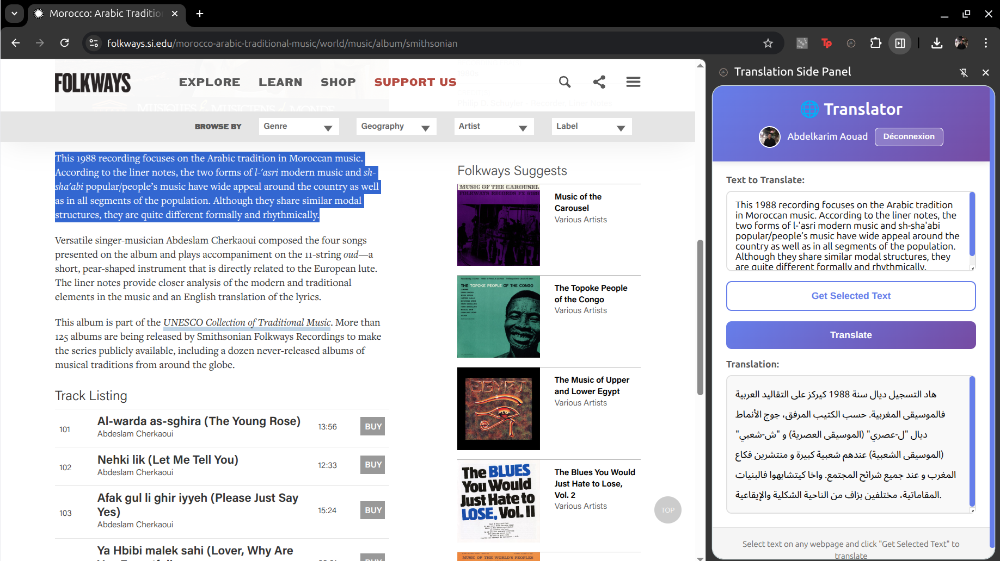

# ToDarija

ToDarija is a web application for automatic translation of text into Darija (Moroccan Arabic) using Google Gemini API. The project provides a Java REST API (JAX-RS) and a modern web interface for easy translation and text correction.

## Main Features
- Automatic translation of text into Darija (Moroccan Arabic)
- Spelling and grammar correction of the source text
- Secure RESTful API (Java, Jakarta EE)
- Web interface and browser extension for client-side usage

## Project Architecture
```
ToDarija/
├── application/ToDarija/         # Java backend (REST API, services, models)
│   ├── src/main/java/org/project # Main source code (API, controllers, services, strategies)
│   ├── src/main/resources        # Config files (application.properties, beans.xml)
│   └── pom.xml                  # Maven dependencies
├── translator-client/           # Web client and browser extension
│   ├── web/                     # Web interface (HTML, JS, CSS)
│   └── extension/               # Browser extension (Chrome/Firefox)
├── docs/images/                 # Images and examples
└── README.md                    # This file
```

## Backend Security Overview

The backend uses a Bearer token authentication mechanism to secure all API endpoints:

- Every incoming HTTP request is intercepted by an authentication filter (`AuthFilter`).
- The filter checks for a valid `Authorization: Bearer <token>` header.
- If the token is missing or invalid, the request is rejected with a `401 Unauthorized` response.
- Only requests with a valid token are processed by the API controllers.

**Key file:** `application/ToDarija/src/main/java/org/project/authentification/AuthFilter.java`


## Layered Architecture & Flow

```
┌─────────────────────────────────────────────┐
│         PRESENTATION LAYER (Frontend)       │
│  - HTML/CSS/JS                              │
│  - Google OAuth 2.0                         │
│  - Fetch API for requests                   │
└─────────────────┬───────────────────────────┘
				  │ HTTP/REST
┌─────────────────▼───────────────────────────┐
│        API LAYER (REST Endpoints)           │
│  - TranslateController                      │
│  - JAX-RS Annotations (@Path, @POST, etc)   │
└─────────────────┬───────────────────────────┘
				  │
┌─────────────────▼───────────────────────────┐
│    BUSINESS LOGIC LAYER (Services)          │
│  - TranslationService                       │
│  - Orchestration & Validation               │
│  - ProcessorFactory (Factory Pattern)       │
└─────────────────┬───────────────────────────┘
				  │
┌─────────────────▼───────────────────────────┐
│     DATA/INTEGRATION LAYER (APIs & Utils)   │
│  - TranslateAPI (Gemini)                    │
│  - TextAPI (Grammar Correction)             │
│  - ClientApiKey (Singleton)                 │
└─────────────────┬───────────────────────────┘
				  │
┌─────────────────▼───────────────────────────┐
│    EXTERNAL SERVICES                        │
│  - Google Gemini API                        │
│  - Google OAuth 2.0                         │
└─────────────────────────────────────────────┘
```

**Flow summary:**
- The frontend authenticates the user (Google OAuth 2.0) and sends translation requests via Fetch API.
- The API layer (TranslateController) receives and validates requests (secured by AuthFilter).
- The business logic layer (TranslationService) orchestrates processing and validation.
- The data/integration layer interacts with Gemini and utility classes for translation and correction.
- External services (Google Gemini API, OAuth) provide AI and authentication.

## Installation & Launch


### Prerequisites
- Java 21 or higher
- Maven 3.8+
- Gemini API key (Google)

#### Configuration
Add your Gemini API key in the file:

`application/ToDarija/src/main/resources/application.properties`

Example:
```properties
gemini.api.key=YOUR_GEMINI_API_KEY
```

### Backend (Java API)
```bash
cd application/ToDarija
mvn clean package
# Deploy the generated WAR file to a Jakarta EE compatible server (Tomcat, Payara, etc.)
```

### Frontend (Web/Extension)
Open the `translator-client/web/` folder in a browser or load the `translator-client/extension/` folder as an unpacked extension in Chrome/Firefox.

## Usage Example



1. Enter text in French or Classical Arabic.
2. The app corrects the text and automatically translates it into Darija.
3. The result is displayed instantly.

## Main Folder Structure
- `application/ToDarija/`: Java REST API, translation logic, Gemini integration
- `translator-client/web/`: User web interface
- `translator-client/extension/`: Browser extension
- `docs/images/`: Images and screenshots

## Technologies Used
- Java 21, Jakarta EE (JAX-RS, CDI)
- Maven
- Google Gemini API (via google-genai)
- HTML, CSS, JavaScript (frontend)

## Author
Abdelkarim AOUAD

## License
This project is open-source under the Apache 2.0 license.

---

## API Documentation

For detailed information on how to use the REST API, including request/response examples, authentication, and parameters, see:
- [API Usage Guide](API_USAGE.md)

## Learn More

- [Contribution Guide](CONTRIBUTING.md)
- [Code of Conduct](CODE_OF_CONDUCT.md)
- [Design Patterns Used](DESIGN_PATTERNS.md)
- [JavaDoc](https://kwimoad.github.io/ToDarija/docs/javadoc/)
